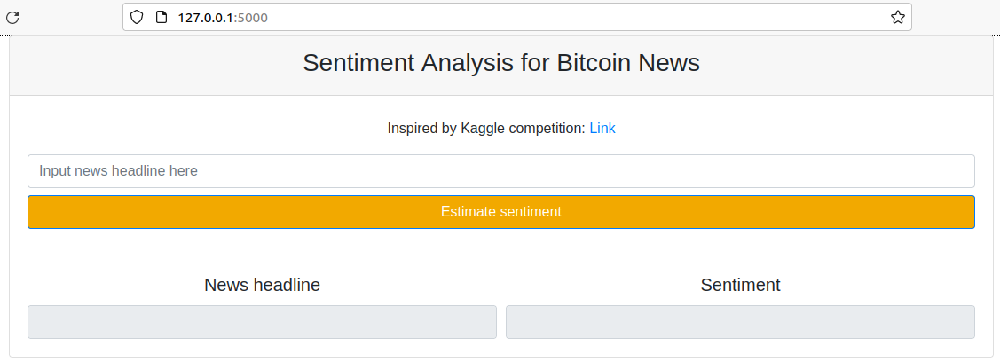

# Bitcoin news sentiment

Flask-ML application to predict the sentiment of Bitcoin news using tf-idf and
logistic regression

## Model reproducibility params:
------------
model_input:
- rnd_seed: 21
- test_size: 0.20
- regularization_strength: 0.01
- class_weight: "balanced"

vectorizer_input:
- max_features: 4000
- ngram_range: [1,2]

NOTE: you can change model params using 'params.yaml'

## Modelling pipeline:
------------
1. src/models/base_model.py

OR

2. notebooks/model.ipynb

## Local model deployment (two alternative ways):
------------
### I. Using virtual environment:
0. Using this option, be aware that application work was tested only on
Ubuntu 20.04.4 LTS, 64-bit
1. Install Python 3.8.5 using pyenv (Python version management):

        $ pyenv install 3.8.5
2. Create local virtual environment using pyenv (Python version management) and
pyenv-virtualenv (virtual environment management):

        $ pyenv virtualenv 3.8.5 <name_of_your_virtualenv>
3. Unzip the repo locally and open a terminal in the repo's directory
4. Activate the pyenv virtual environment in the project's diroctory:

        $ pyenv local <name_of_your_virtualenv>
5. If you work in repository through VS Code, you usually have additionally
to activate virtual environment for repo using:

        Shift + Ctrl + P -> Python: Select Interpreteur ->
        choose your environment and run a terminal for the following instructions
6. To be sure that you use a relevant virtual environment use:

        $ pyenv version
    or

        $ pyenv versions
7. Install all the necessary deployment libraries and dependencies using:

        $ pip install -r requirements.txt
8. To check the list of the dependencies installed to the virtual environment use:

        $ pip list
9. Run the application from the repo directory using:

        $ python app.py

10. You can check the application work in your browser running:

        http://127.0.0.1:5000
11. To stop the application use Ctrl+C in your terminal
12. If you don't have pyenv as a version management, use following instructions: [Link](https://realpython.com/intro-to-pyenv/#installing-pyenv)
13. If you don't have pyenv-virtualenv as a virtual environment management, use
following insturctions: [Link1](https://github.com/pyenv/pyenv-virtualenv), [Link2](https://realpython.com/intro-to-pyenv/#virtual-environments-and-pyenv)

### II. Using Docker (recommended option):
1. Unzip the repo locally and open a terminal in the repo's directory
2. (optionally) Inslall Docker if you don't have it: [Link](https://docs.docker.com/engine/install/)
3. Run the following in a terminal to build a Docker image:

        $ docker build -t bitcoin_sentiment .
4. Run the following in a terminal to run an application in a Docker container:

        $ docker run --rm -it -p 5000:5000 bitcoin_sentiment
5. You can check the application work in your browser running:

        http://127.0.0.1:5000
6. To stop the application use Ctrl+C in your terminal
------------

### Finally, you'll have to see this:

## Project Organization
------------

    ├── README.md          <- The top-level README with the deployment instuctions
    |
    ├── data
    │   └── raw            <- The original, immutable data dump.
    │
    ├── model              <- Trained and serialized models, model predictions, or model summaries
    │
    ├── notebooks          <- Jupyter notebooks. Naming convention is a number (for ordering),
    │                         the creator's initials, and a short `-` delimited description, e.g.
    │                         `1.0-jqp-initial-data-exploration`.
    │
    ├── references         <- Data dictionaries, manuals, and all other explanatory materials.
    │
    ├── templates          <- A folder for .html templates
    |
    ├── params.yaml        <- Model params and artifacts paths
    |
    ├── libs.txt           <- A list of installed libraries (deployment)
    │
    ├── libs-dev.txt       <- A list of installed libraries (dev)
    |
    ├── requirements.txt   <- The deployment requirements file for reproducing the analysis environment, e.g.
    │                         generated with `pip freeze > requirements.txt`
    |
    ├── requirements-dev.txt   <- The requirements file for reproducing the project (dev)
    |
    ├── Dockerfile         <- A script with instructions to build the project Docker image
    |
    ├── app.py             <- Flask application script
    |
    ├── src                <- Source code for use in this project.
    │   ├── __init__.py    <- Makes src a Python module
    │   │
    │   └── models         <- Scripts to train models and then use trained models to make
    │       │                 predictions
    │       ├── predict_model.py
    │       └── train_model.py
    |
    ├── .pre-commit-config.yaml <- A script that automatically activates linters and formatters before each commit
    |
    └── tox.ini            <- tox file with settings for running tox; see tox.readthedocs.io
